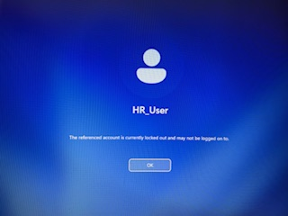
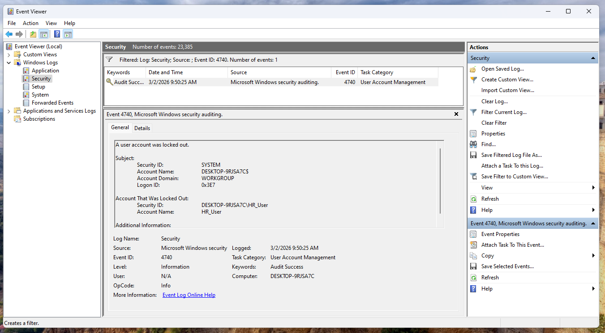
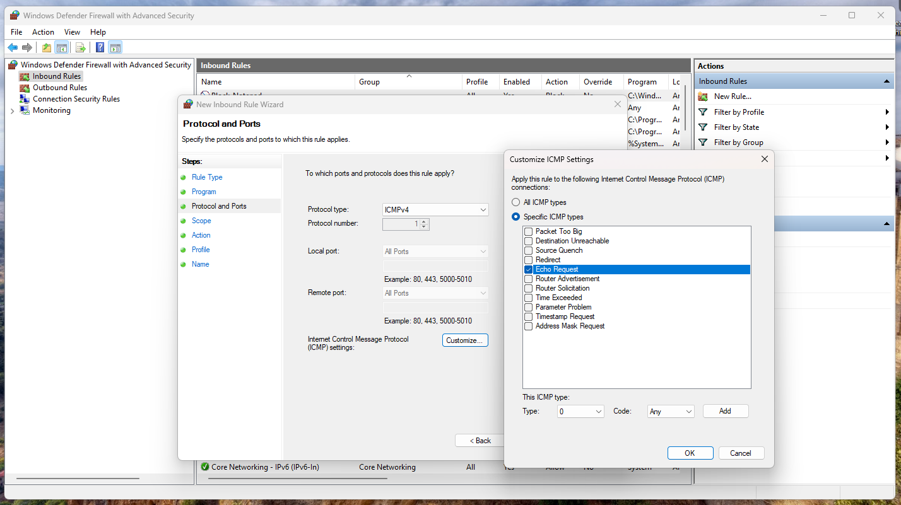
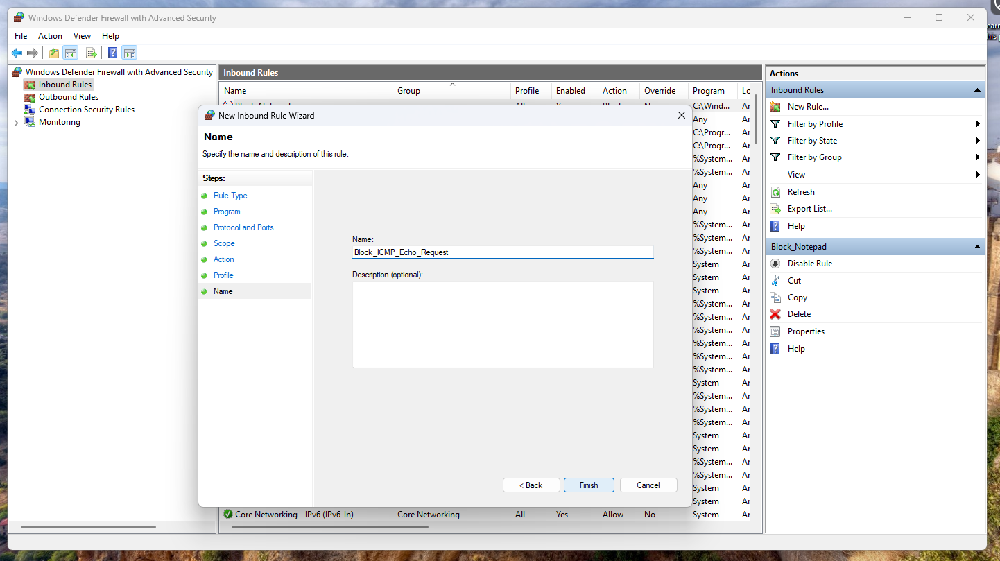
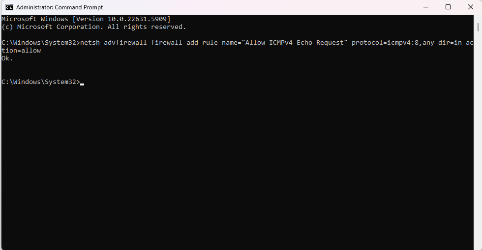
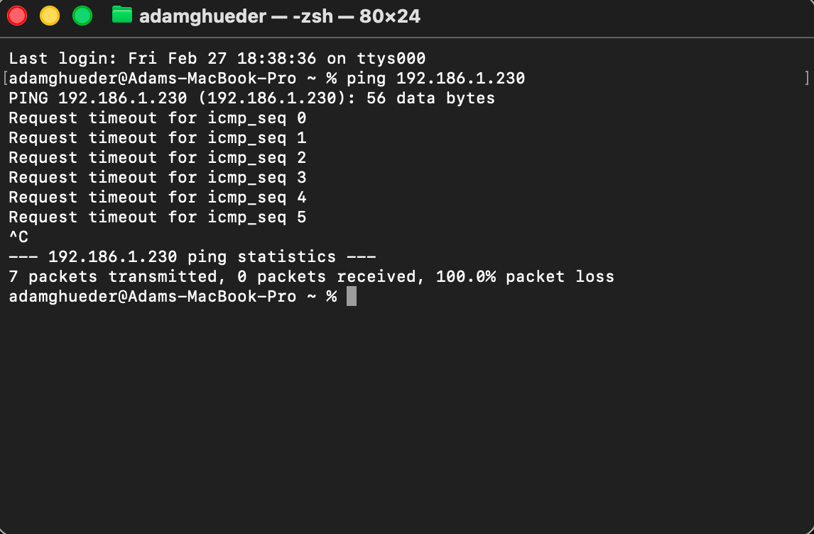
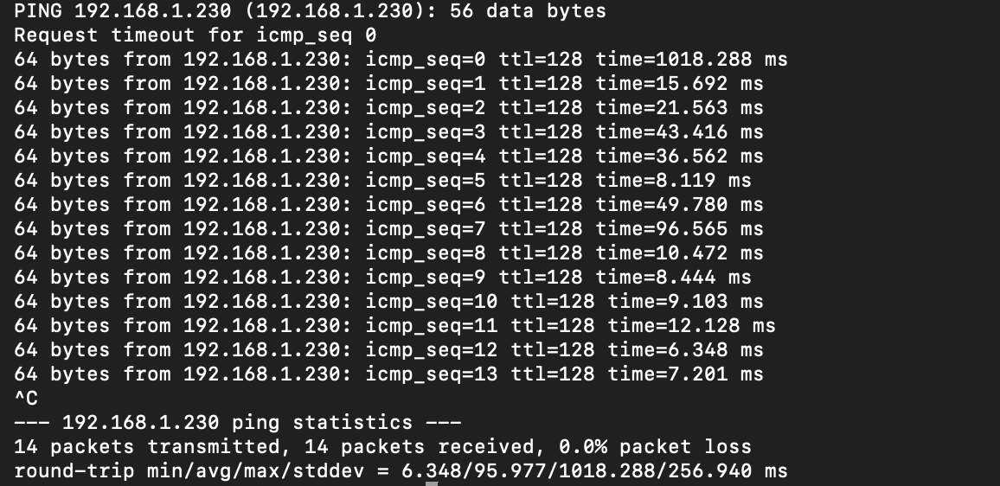
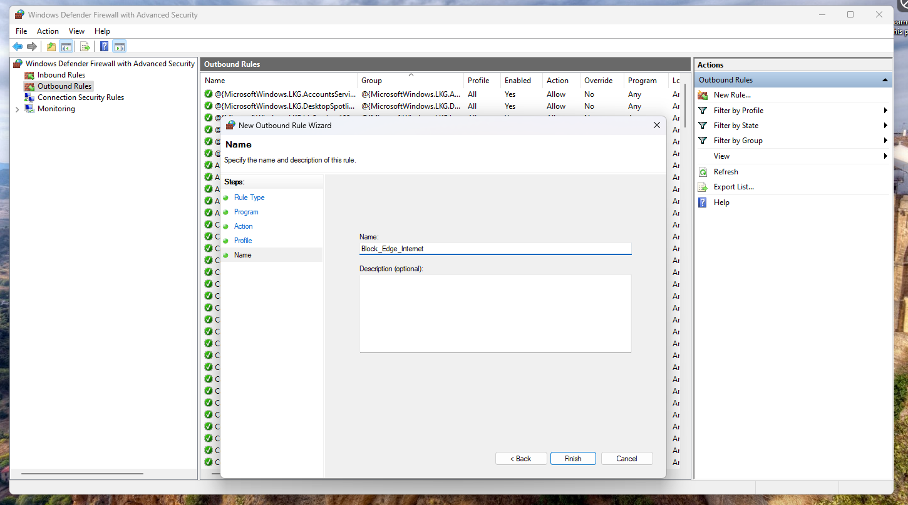
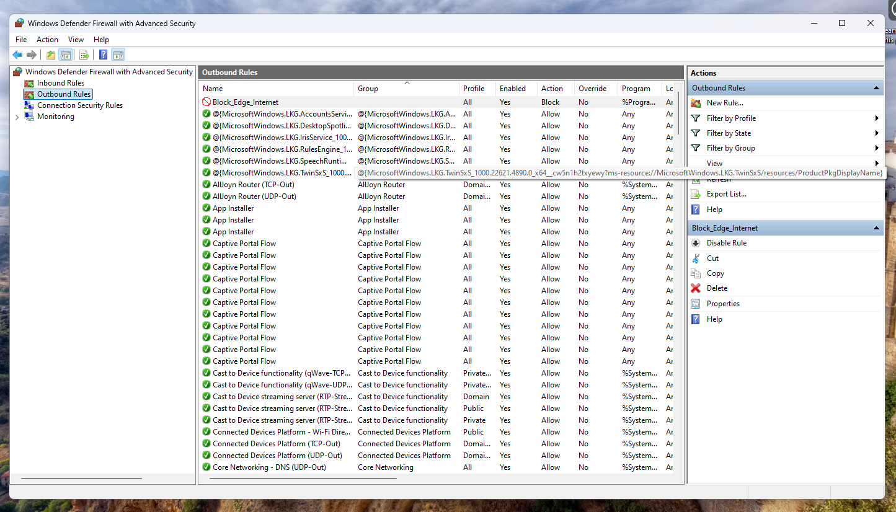
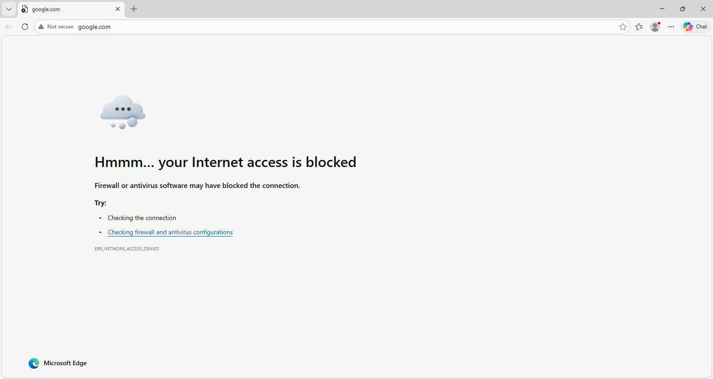

# windows-endpoint-hardening-lab
Configured Windows Defender Firewall, implemented ICMP rules, enforced account lockout policies, and validated network security through cross-platform testing.

# Windows 11 Endpoint Hardening & Firewall Configuration Lab

## Overview
In this lab, I configured and hardened a Windows 11 Home endpoint using built-in security tools. 
The objective was to simulate real-world IT support and endpoint security tasks.

---

## Skills Demonstrated

- Windows Defender Firewall configuration
- Custom inbound rule creation (ICMPv4)
- Command-line firewall management (netsh)
- Account lockout policy configuration
- Password policy enforcement
- Event Viewer log analysis
- Cross-platform network diagnostics (macOS → Windows)
- ICMP troubleshooting & packet loss analysis

---

## Security Configurations Implemented

### 1️⃣ Account Policy Hardening

Configured via Command Prompt:

```
net accounts /minpwlen:12
net accounts /lockoutthreshold:3
net accounts /lockoutduration:15
```

✔ Minimum password length set to 12  
✔ Lockout threshold set to 3 attempts  
✔ Lockout duration set to 15 minutes  

---

### 2️⃣ Account Lockout Validation

Triggered failed login attempts and confirmed:

- Account lockout message displayed
- Event ID 4740 logged in Event Viewer

---

### 3️⃣ Windows Defender Firewall Hardening

Created inbound ICMP block rule:

- Block ICMPv4 Echo Request

Validated:
- 100% packet loss from external device

Then created allow rule:

```
netsh advfirewall firewall add rule name="Allow ICMPv4 Echo Request" protocol=icmpv4:8,any dir=in action=allow
```

Validated:
- Successful ping responses
- 0% packet loss
- TTL=128 confirming Windows host

---

### 4️⃣ Cross-Platform Network Testing

Tested connectivity from macOS device:

```
ping 192.168.1.230
```

Observed:
- Packet loss during block rule
- Successful replies after allow rule implementation

---

## Evidence & Screenshots

### Account Lockout Screen


---

### Event Viewer – Event ID 4740 (Account Lockout)


---

### ICMP Block Rule Configured



---

### ICMP Allow Rule Configured


---

### Ping Test – Blocked (100% Packet Loss)


---

### Ping Test – Successful (0% Packet Loss)

---

### Block Edge Internet - Successful




## What This Demonstrates

This lab simulates real-world endpoint security configuration and troubleshooting scenarios commonly encountered in:

- Help Desk roles
- IT Support Technician positions
- Junior System Administrator roles
- Desktop Support positions

---

## Outcome

Successfully hardened a Windows 11 endpoint and validated security posture using command-line tools and network diagnostics.
