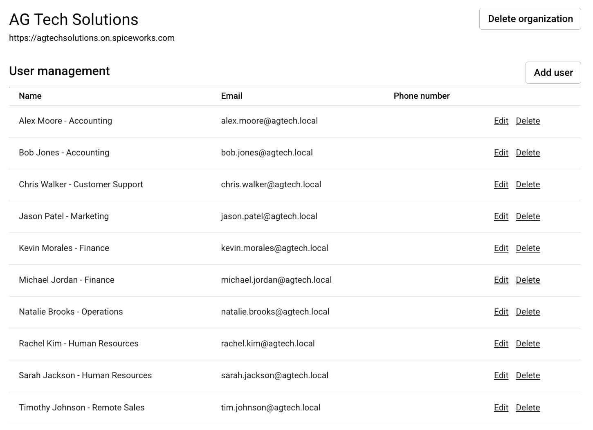
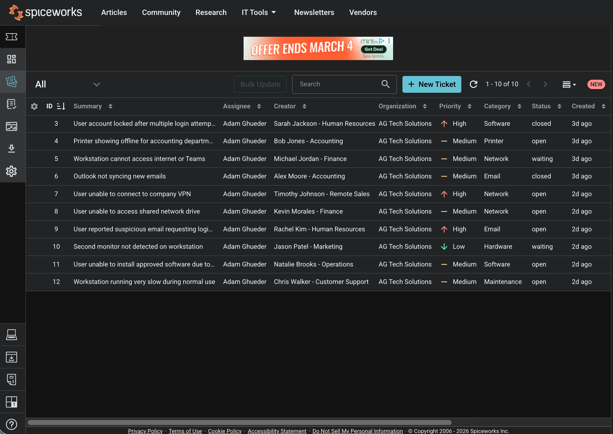
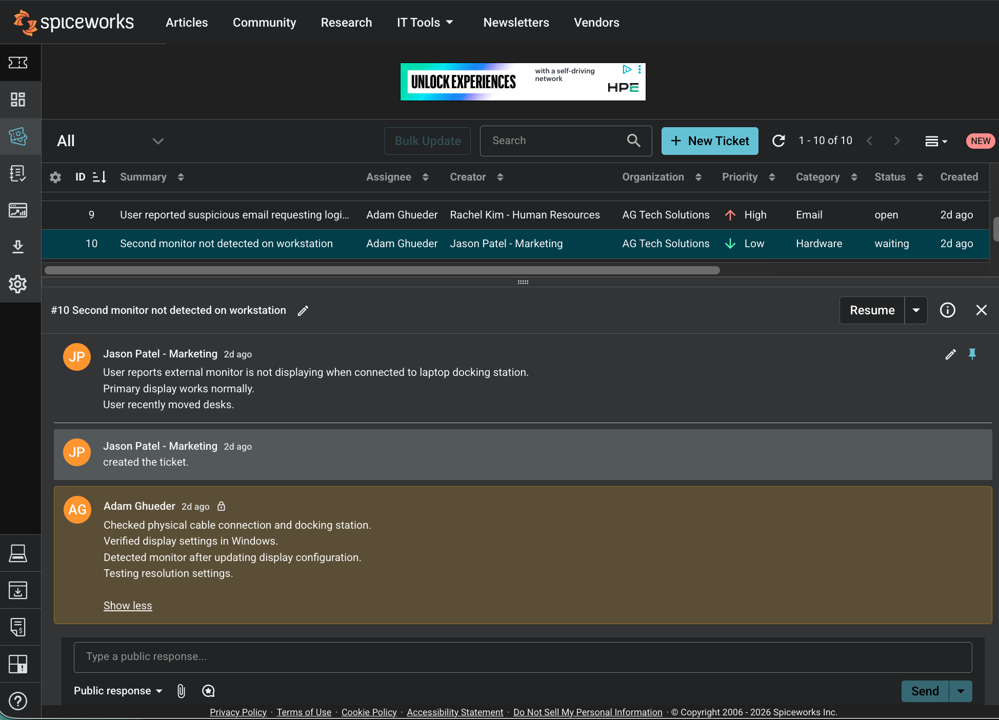
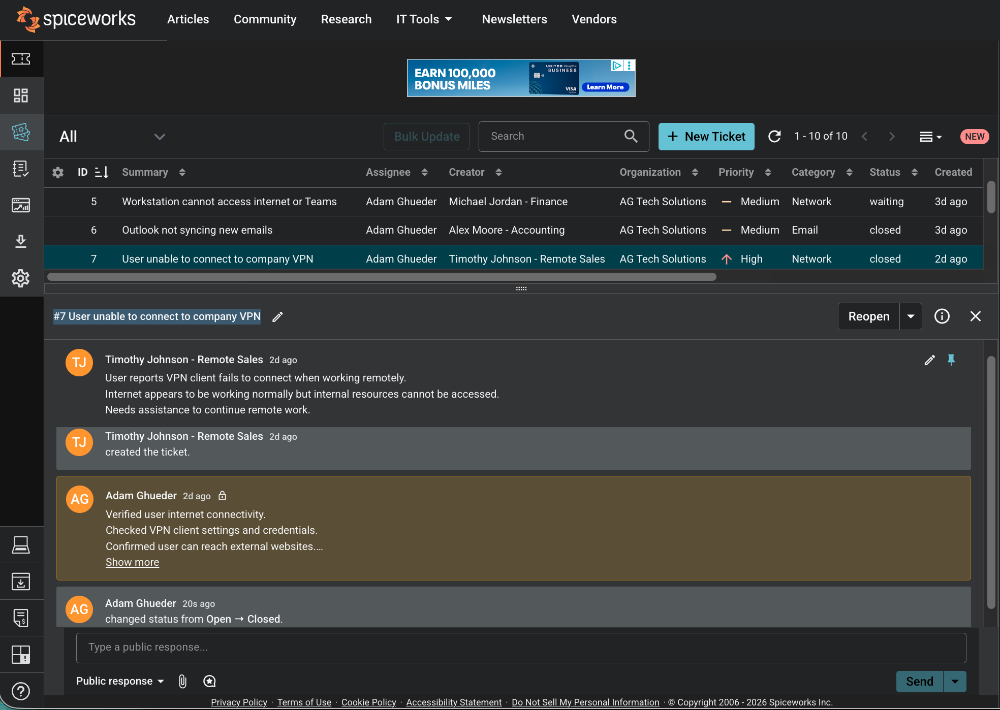

# Spiceworks Help Desk Simulation

## Overview
This project simulates a real-world IT Help Desk environment using Spiceworks Cloud Help Desk.  
A fictional organization (AG Tech Solutions) was created to practice ticket intake, incident tracking, prioritization, and troubleshooting documentation.

The objective was to replicate daily Help Desk responsibilities including managing multiple user issues, updating ticket statuses, documenting troubleshooting steps, and resolving incidents following a structured workflow.

---

## Key Skills Demonstrated
- Ticket Lifecycle Management (Open → In Progress → Waiting → Closed)
- Incident Categorization & Priority Assignment
- End-User Troubleshooting Documentation
- Help Desk Workflow Simulation
- Communication & Resolution Notes
- Basic IT Incident Response Practices

---

## Example Tickets Created
- User Account Lockout
- Printer Showing Offline (Accounting Department)
- VPN Connectivity Issue (Remote User)
- Outlook Email Sync Problems
- Slow Workstation Performance
- Shared Network Drive Access Issue
- Second Monitor Not Detected

---

## Technologies & Tools Used
- Spiceworks Cloud Help Desk
- Windows 11 Virtual Machine
- Simulated Corporate Environment (AG Tech Solutions)

---

## Project Screenshots

### User Management Setup

### Help Desk Dashboard

### Printer Troubleshooting Ticket

### Hardware Issue Ticket

### VPN Incident Resolution

### My Tickets View

