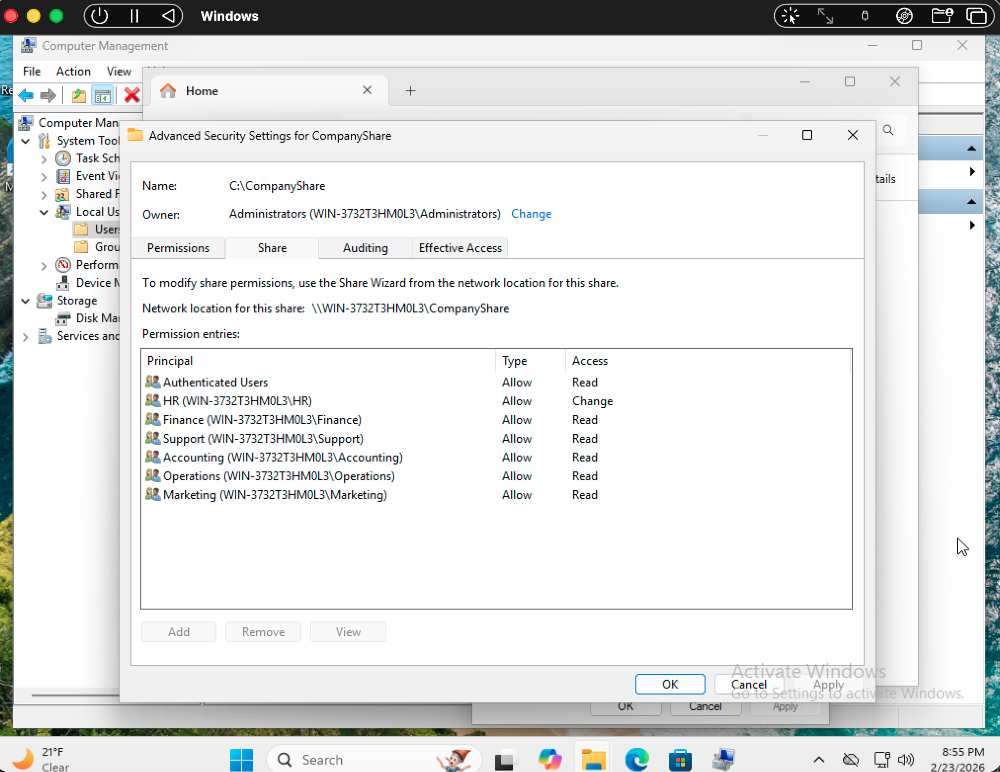

# Windows File Server RBAC Lab

## Overview
This lab demonstrates the implementation of Role-Based Access Control (RBAC) within a Windows file server environment using a Windows 11 virtual machine.

A simulated corporate shared drive was created with department-based access restrictions using security groups, NTFS permissions, and SMB share permissions. The objective was to replicate real-world Help Desk and Junior System Administration responsibilities such as user provisioning, permission management, access troubleshooting, and validation testing.

---

## Key Skills Demonstrated
- User and Group Administration
- NTFS Permission Management
- SMB Share Configuration
- Least-Privilege Access Design
- Access Control Validation & Testing
- Help Desk Troubleshooting Methodology

---

## Technologies Used
- Windows 11 Virtual Machine (UTM on Apple Silicon)
- Local Users and Groups
- NTFS Permissions
- SMB Network Share (`\\localhost`)
- Role-Based Access Control (RBAC)

---

## User & Group Setup
Created simulated company departments:

- HR
- Finance
- Marketing
- Operations
- Accounting
- Customer Support

Each user account was placed into a department-based security group to enforce least-privilege access across shared resources.

---

## Project Screenshots

### Company Share Structure

### Security Group Configuration

### NTFS Permission Configuration

### Share Permission Configuration

### Access Denied Validation Test

### Authorized Access Validation

