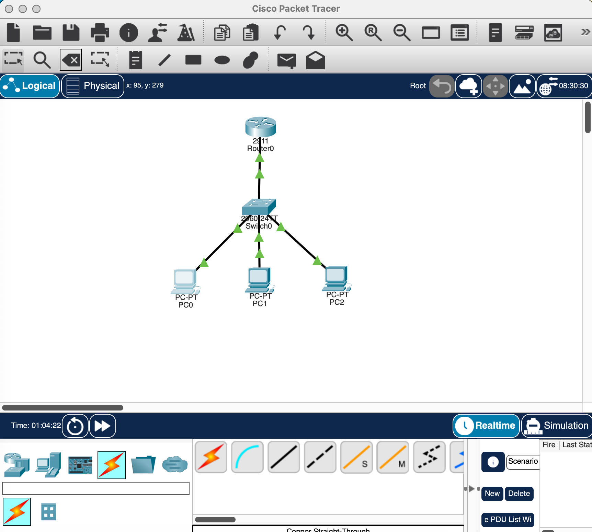
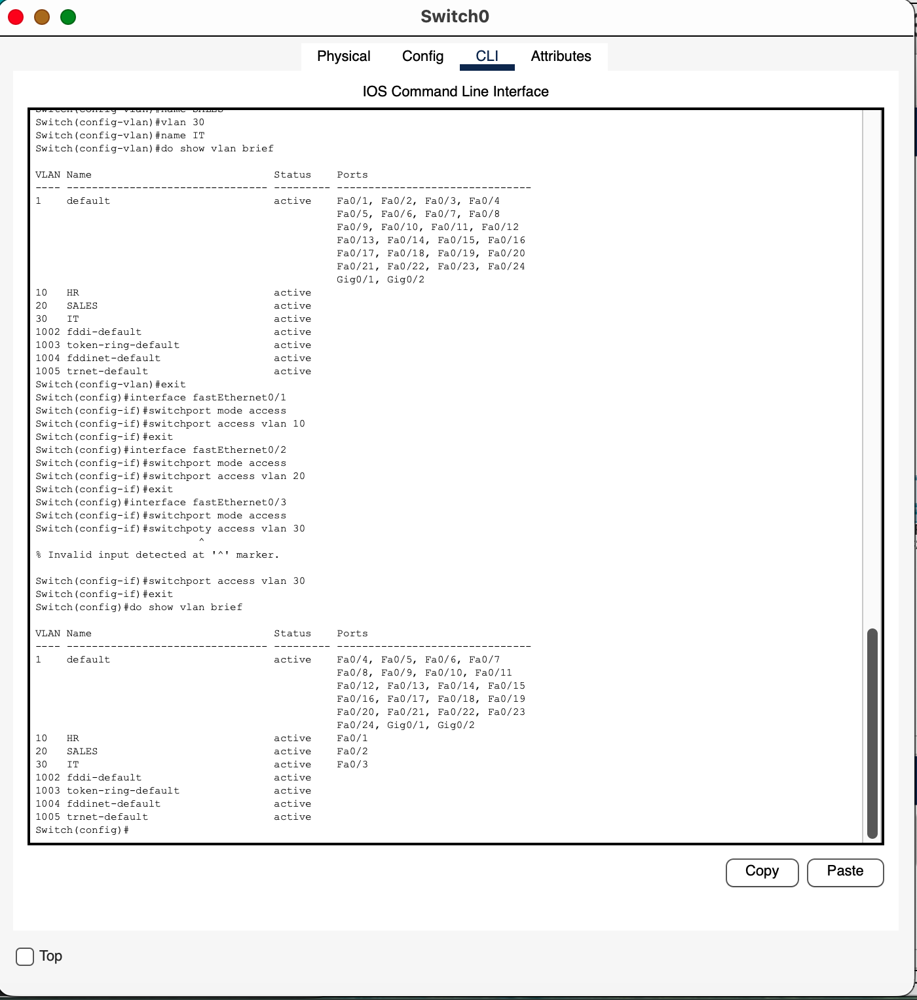
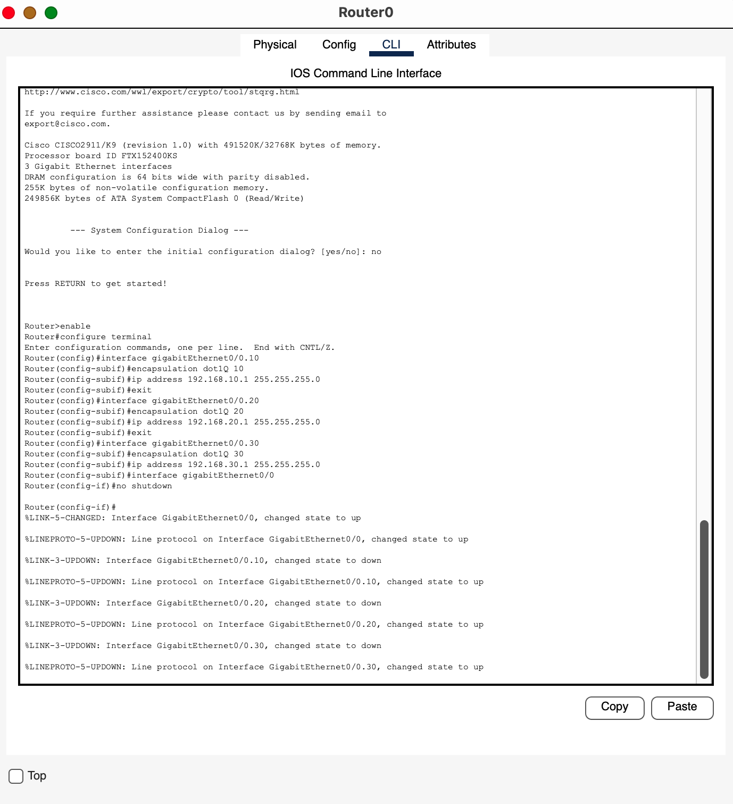
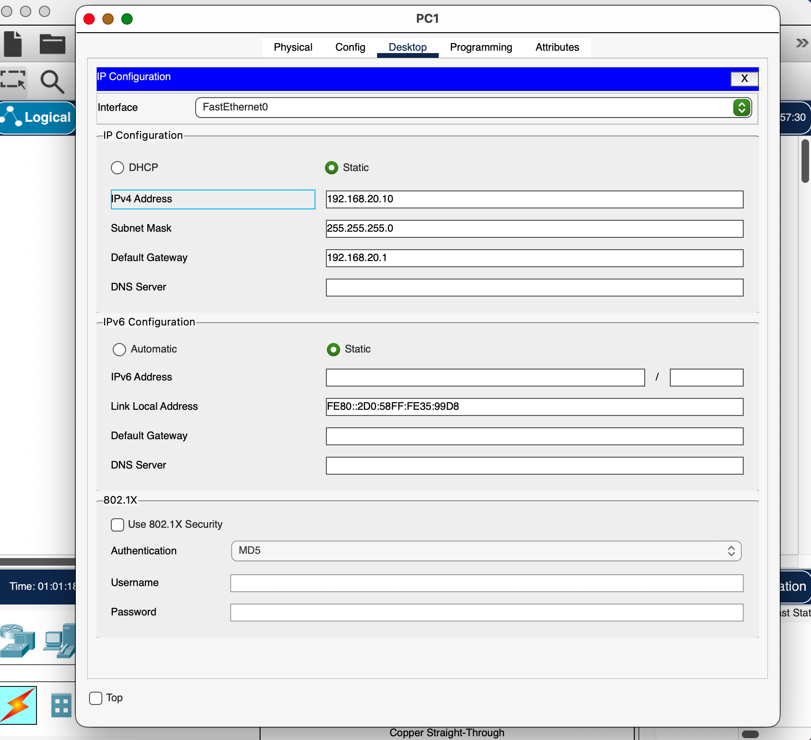
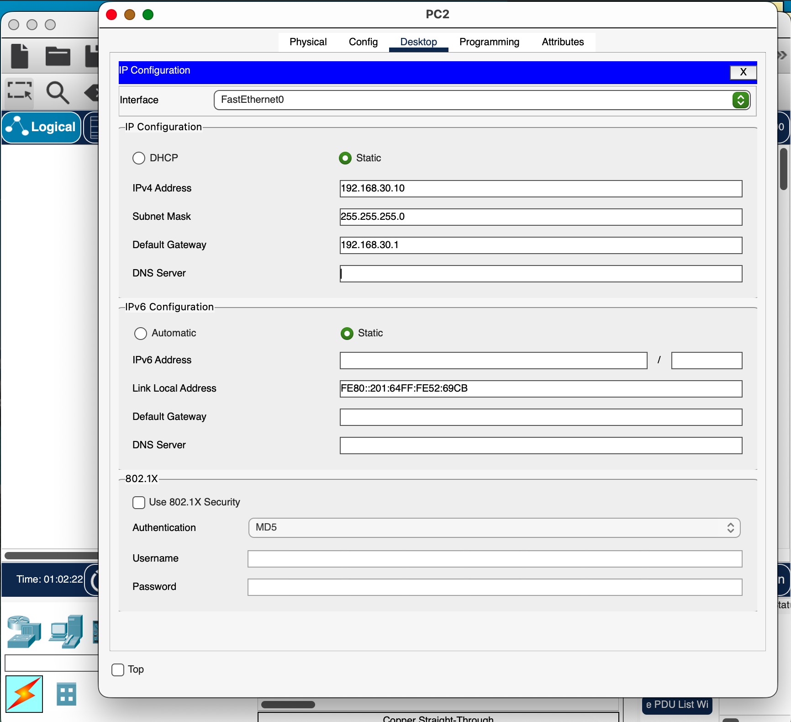
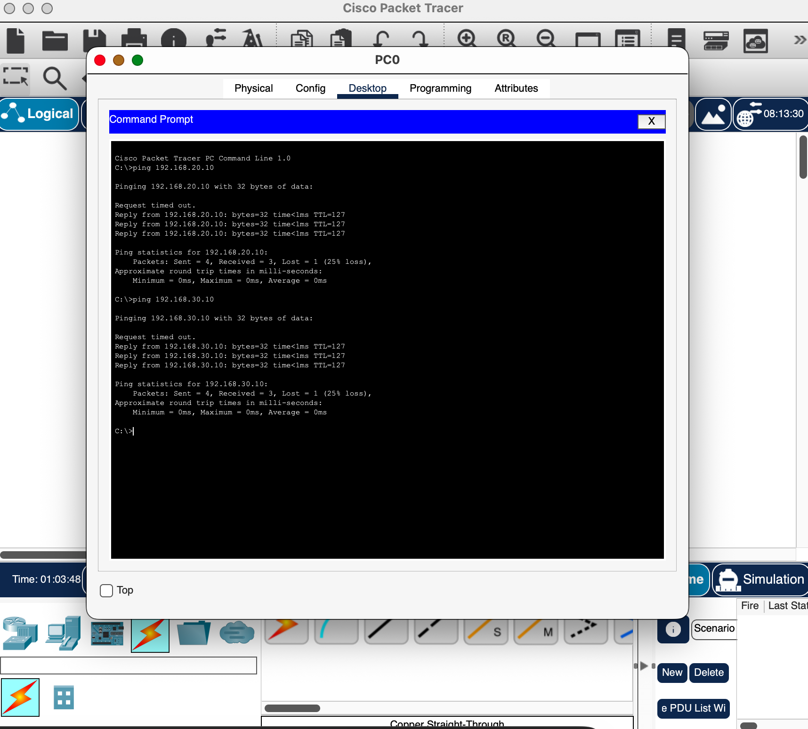

# Cisco Packet Tracer VLAN Network Lab

## Overview

Built a simulated small business network using Cisco Packet Tracer to demonstrate VLAN segmentation and inter-VLAN routing using a router-on-a-stick configuration.

## Skills Demonstrated

- VLAN Creation
- Switch Port Assignment
- Trunk Configuration
- Router-on-a-Stick
- Inter-VLAN Routing
- IP Address Configuration
- Network Connectivity Testing

## Network Design

Three departments were segmented into separate VLANs.

| Department | VLAN | Network |
|------------|------|---------|
| HR | 10 | 192.168.10.0/24 |
| Sales | 20 | 192.168.20.0/24 |
| IT | 30 | 192.168.30.0/24 |

Each VLAN communicates through a Cisco router using subinterfaces.

## Devices Used

- Cisco 2911 Router
- Cisco 2960 Switch
- 3 PCs
- Cisco Packet Tracer

## Key Configuration Tasks

### VLAN Creation

Configured VLANs on the switch for departmental segmentation.

### Access Ports

Assigned switch ports to VLANs.

### Trunk Port

Configured trunking between the router and switch.

### Router-on-a-Stick

Configured router subinterfaces with 802.1Q encapsulation.

### IP Addressing

Assigned static IP addresses to hosts.

### Connectivity Testing

Verified successful communication between VLANs using ping.

## Screenshots

### Network Topology

### VLAN Port Assignment

### Router-on-a-Stick Configuration

### PC IP Configuration

### Successful Inter-VLAN Ping Test

## Tools Used

Cisco Packet Tracer
